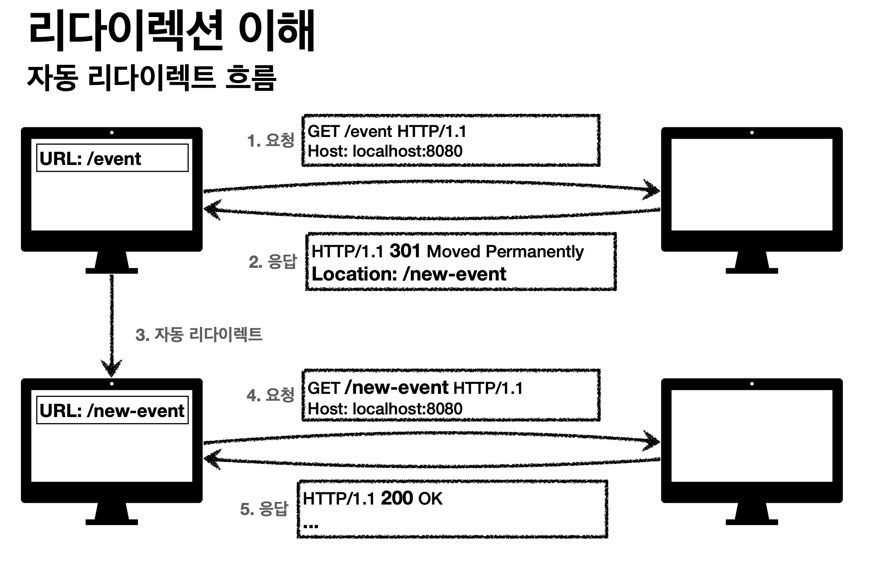
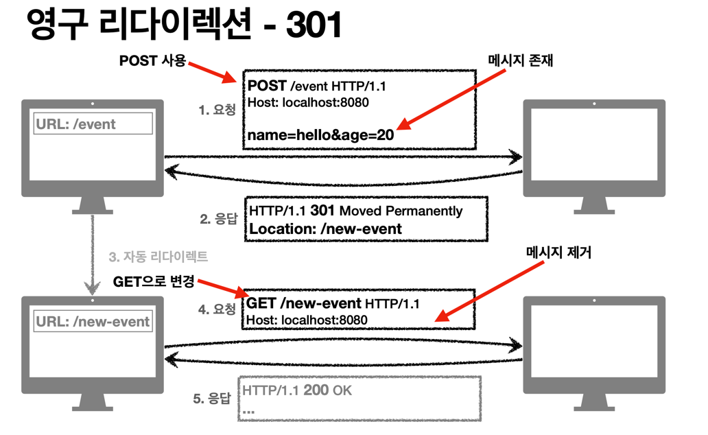
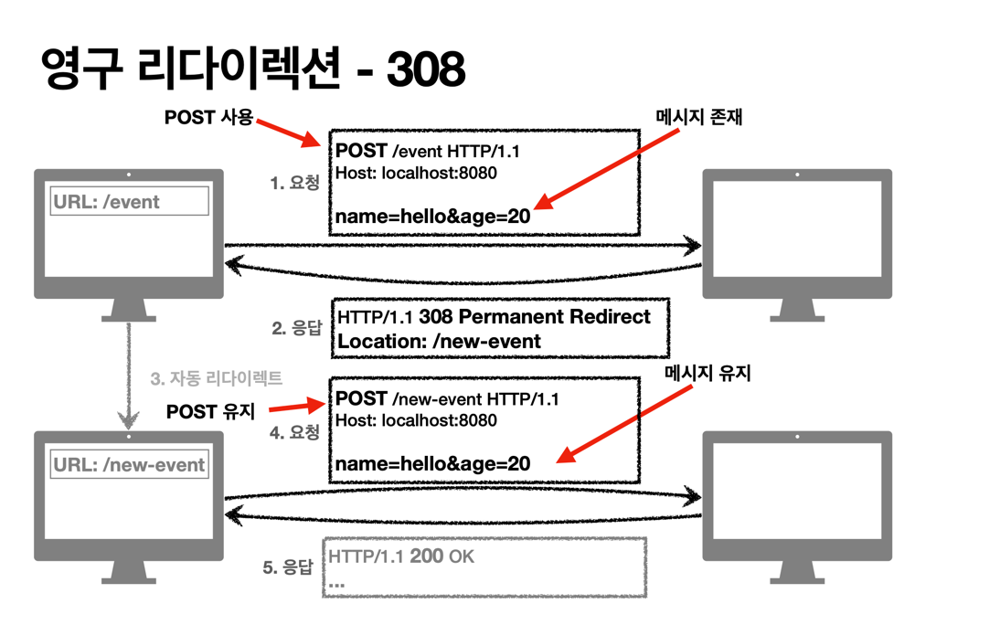

# 3xx (Redirection)
`리다이렉션: 웹 브라우저는 3xx 응답의 결과에 Location 헤더가 있으면, Location 위치로 자동 이동 (리다이렉트)`  

**요청을 완료허기 위해 유저 에이전트의 추가 조치 필요**  
`유저 에이전트란 클라이언트 프로그램 주로 웹 브라우저, 앱 클라이언트 등`
- 300 Multiple Choices
- 301 Moved Permanently
- 302 Found
- 303 See Other
- 304 Not Modified
- 307 Temporary Redirect
- 308 Permanent Redirect

## 리다이렉션 흐름

`기존 경로 /event -> /new-event로 경로가 바뀌었다고 가정해본다.`
> 1. 클라이언트에서 /event 경로로 요청을 한다
> 2. 서버에서 경로가 바뀌었으니 새로운 경로로 리다이렉트 상태코드를 보낸다. (3xx)
> 3. 클라이언트는 Location 필드를 보고 해당 경로로 재요청 한다.
> 4. 서버에서는 새로운 경로로 온 요청에 대해 응답해준다.

`사용자는 이 과정이 매우 빨라서 인식 할 수 없다.`

 

## 리다이렉션 종류
- **영구 리다이렉션** (새로운 경로로 영구적으로 변경)
  - 예) /members -> /users
  - 예) /evetn -> /new-event
- **일시 리다이렉션** (일시적으로 잠깐 이동 시킬 때)
    - 주문 완료 후 주문 내역 화면으로 이동 (리다이렉트)
    - PRG: POST/Redirect/GET (중복 저장을 막기 위한 패턴)
- **특수 리다이렉션**
  - 결과 대신 캐시를 사용

 

## 영구 리다이렉션 종류
- 리소스가 URI가 영구적으로 이동
- 원래의 URL을 사용 하지 않는다. 검색 엔진 등에서도 변경을 인지한다.
- **301 Moved Permanently**
  - `리다이렉트 요청 시 메서드가 GET으로 변하고, 본문이 제거될 수 있다 예)처음 POST 요청 했는데 -> 리다이렉트는 GET 메서드`
- **308 Permanent Redirect**
  - 301과 기능은 같다.
  - 리다이렉트 요청 메서드와 본문 유(처음 POST 요청하면 리다이렉트도 POST 유지)

 

## 영구 리다이렉션 - 301
- 
>1. Client -> Server 요청 (POST, 메시지 바디 존재)
>2. Server -> Client 응답 (Location필드, 301 리다이렉트 상태코드)
>3. 자동 리다이렉트 GET 메서드 변경
>4. Client -> Server 요청 (GET 메서드로 변경, 메시지 바디 삭제)
>5. Server -> Client 응답 (상태코드 200 OK)

`이런 경우는 POST로 서버에 데이터를 저장해달라고 요청헀지만 리다이렉트 되면서 GET 메서드로 변경됐다
그러므로 사용자는 처음부터 다시 입력하는 과정을 거쳐하는 불편사항이 있다`
 

## 영구 리다이렉션 - 308
- 
>1. client -> server 요청 (POST, 메시지 바디 존재)
>2. server -> client 응답 (Location필드, 308 리다이렉트 상태코드)
>3. 자동 리다이렉트 POST메서드 유지, 메시지 바디 유지
>4. client -> server 요청 (POST 메서드 유지, 메시지 바디 유지)
>5. server -> client 응답 (상태코드 200 ok)

`/enent -> /new-event로 바뀌면 어차피 내부적으로 전달해야하는 데이터가 대부분 변경돼서 POST로 와도 GET 메서드로 돌리는게 맞다.
대부분 301을 사용한다.`
