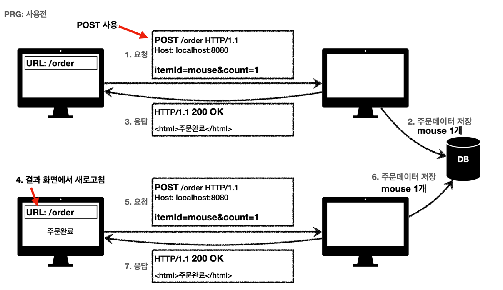
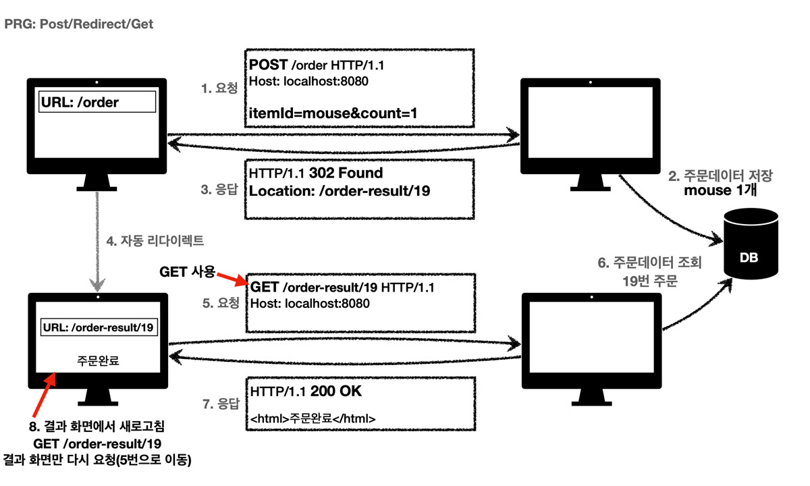

# 3xx (Redirection)
`리다이렉션: 웹 브라우저는 3xx 응답의 결과에 Location 헤더가 있으면, Location 위치로 자동 이동 (리다이렉트)`  

**요청을 완료허기 위해 유저 에이전트의 추가 조치 필요**  
`유저 에이전트란 클라이언트 프로그램 주로 웹 브라우저, 앱 클라이언트 등`
- 300 Multiple Choices
- 301 Moved Permanently
- 302 Found
- 303 See Other
- 304 Not Modified
- 307 Temporary Redirect
- 308 Permanent Redirect

## 리다이렉션 흐름

`기존 경로 /event -> /new-event로 경로가 바뀌었다고 가정해본다.`
> 1. 클라이언트에서 /event 경로로 요청을 한다
> 2. 서버에서 경로가 바뀌었으니 새로운 경로로 리다이렉트 상태코드를 보낸다. (3xx)
> 3. 클라이언트는 Location 필드를 보고 해당 경로로 재요청 한다.
> 4. 서버에서는 새로운 경로로 온 요청에 대해 응답해준다.

`사용자는 이 과정이 매우 빨라서 인식 할 수 없다.`

 

## 리다이렉션 종류
- **영구 리다이렉션** (새로운 경로로 영구적으로 변경)
  - 예) /members -> /users
  - 예) /evetn -> /new-event
- **일시 리다이렉션** (일시적으로 잠깐 이동 시킬 때)
    - 주문 완료 후 주문 내역 화면으로 이동 (리다이렉트)
    - PRG: POST/Redirect/GET (중복 저장을 막기 위한 패턴)
- **특수 리다이렉션**
  - 결과 대신 캐시를 사용

 

## 영구 리다이렉션 종류
- 리소스가 URI가 영구적으로 이동
- 원래의 URL을 사용 하지 않는다. 검색 엔진 등에서도 변경을 인지한다.
- **301 Moved Permanently**
  - `리다이렉트 요청 시 메서드가 GET으로 변하고, 본문이 제거될 수 있다 예)처음 POST 요청 했는데 -> 리다이렉트는 GET 메서드`
- **308 Permanent Redirect**
  - 301과 기능은 같다.
  - 리다이렉트 요청 메서드와 본문 유(처음 POST 요청하면 리다이렉트도 POST 유지)

 

## 영구 리다이렉션 - 301
- 
>1. Client -> Server 요청 (POST, 메시지 바디 존재)
>2. Server -> Client 응답 (301 리다이렉트 응답. /new-event로 리다이렉트)
>3. 자동 리다이렉트 GET 메서드 변경
>4. Client -> Server 요청 (/new-event GET 메서드로 변경, 메시지 바디 삭제)
>5. Server -> Client 응답 (상태코드 200 OK)

`이런 경우는 POST로 서버에 데이터를 저장해달라고 요청헀지만 리다이렉트 되면서 GET 메서드로 변경됐다
그러므로 사용자는 처음부터 다시 입력하는 과정을 거쳐하는 불편사항이 있다`
 

## 영구 리다이렉션 - 308
- 
>1. client -> server 요청 (POST, 메시지 바디 존재)
>2. server -> client 응답 (308 리다이렉트 응답. /new-event로 리다이렉트)
>3. 자동 리다이렉트 POST메서드 유지, 메시지 바디 유지
>4. client -> server 요청 (/new-event POST 메서드 유지, 메시지 바디 유지)
>5. server -> client 응답 (상태코드 200 ok)

`/enent -> /new-event로 바뀌면 어차피 내부적으로 전달해야하는 데이터가 대부분 변경돼서 POST로 와도 GET 메서드로 돌리는게 맞다.
대부분 301을 사용한다.`

 

## 일시 리다이렉션 종류
- 리소스의 URI가 일시적으로 변경된다
- 따라서 검색 엔진 등에서 URL을 변경하면 안된다
- **302 Found**
  - 리다이렉트 요청 메서드가 GET 메서드로 변하고, 본문이 제거될 수있음(MAY)
- **307 Temporary Redirect**
  - 302와 기능은 같다
  - 리다이렉트 요청시 메서드, 본문 유지(요청 메서드를 변경화면 안된다. MUST NOT)
- **303 See Other**
  - 302와 기능은 같다
  - 리다이렉트시 요청 메서드가 GET으로 변경 된다

 

## PRG: POST/Redirection/GET 패턴 도입 전 예시)
- POST로 주문후에 웹 브라우저가 새로고침을 하면?
- 새로고침은 다시 요청(직전에 요청한 URL에 다시 요청 한다)
- 중복 주문이 될 수 있다.

### PRG 사용 전

>1. client -> server 요청 (POST, 메시지 바디 존재)
>2. 서버 내부에서 DB에 주문 데이터 데이터 저장
>3. server -> client 응답 (200 응답. 주문완료 창이 나오는 html 응답)
>4. 여기서 만약 사용자가 결과 html에서 새로고침을 누르면?
>5. client -> server 요청 (POST, 메시지 바디 존재) 이 과정을 다시 반복
>6. 서버 내부에서 DB에 동일한 데이터 저장 (중복 주문)
>7. server -> client 응답 (주문완료 창이 나오는 html 응답)

`사용자가 실수로 새로고침을 누르면 중복 주문이 들어간다. 새로고침을 하는 횟수만큼 중복 주문발생. 이러한 문제. 때문에 PRG 패턴을 사용해야 한다.`
`원칙적으로 서버에서 중복주문이 일어나지 않도록 막아야한다 하지만 클라이언트 에서도 한번 더 막아주는게 좋다 `
`여기서 말하는 서버에서는 예를들어 같은 주문번호를 체크하는 방법 등..`

## PRG: POST/Redirection/GET 패턴 도입 후 예시)
- POST로 주문 후에 새로 고침으로 인한 중복 주문 방지
- POST로 주문후에 주문 결과 화면을 GET 메서드로 리다이렉트
- 새로고침을 해도 결과화면을 GET 메서드로 조회 하기 때문에 중복주문이 일어나지 않는다

### PRG 사용 후

>1. client -> server 요청 (POST 요청, 메시지 바디 존재)
>2. 서버 내부에서 DB에 주문 데이터 데이터 저장
>3. server -> client 응답 (리다이렉트 302 응답. /order-result/19로 리다이렉트. 주문번호를 19번으로 서버에서 생성했다는 가정.)
>4. 자동 리다이렉트 GET 메서드 변경
>5. client -> server 요청 (/order-result/19 경로로 GET 메서드 요청)
>6. 서버 내부에서 DB에 접근해 19번 주문 데이터 조회
>7. server -> client 응답 (200 응답. 주문완료 html 응답)
>8. client는 주문완료 화면에서 새로고침을 해도 GET /order-result/19로 결과화면만 요청하니 중복주문이 발생하지 않는다.(5번으로 이동).

- PRG 이후 리다이렉트
  - URL이 이미 POSt -> GET메서드로 리다이렉트 됨
  - 새로 고침해도 GET 으로 결과 화면만 조회 

- PRG 장점
  - 사용자 입장에서도 실수로 새로고침을 해도 결과 화면만 보이니 사용성이 좋다.
  - 서버 입장에서도 오류가 줄어든다.

 

## 상황에 따른 리다이렉션
- 정리
  - 302 Found -> GET으로 변할 수 있음
  - 307 Temporary Redirect -> 메서드가 변하면 안됨
  - 303 See Other -> 메서드가 GET으로 변경
- 상태코드 역사
  - 처음 302 스펙의 의도는 HTTP 메서드를 유지하는 것
  - 그런데 웹 브라우저들이 대부분 GET으로 바꾸어버림(일부는 다르게 동작)
  - 그래서 모호한 302를 대신하는 명확한 307, 303이 등장함(301 대응으로 308도 등장)
- 현실
  - 307, 303을 권장하지만 현실적으로 이미 많은 애플리케이션 라이브러리들이 302를 기본값으로 사용
  - 자동 리다이렉션시에 GET으로 변해도 되면 그냥 302를 사용해도 큰 문제 없음

 

## 기타 리다이렉션
- 300 Multiple Choices: 안쓴다.
- 304 Not Modified
  - 캐시를 목적으로 사용
  - 클라이언트에게 리소스가 수정되지 않았음을 알려준다. 따라서 클라이언트는 로컬PC에
    저장된 캐시를 재사용한다. (캐시로 리다이렉트 한다.)
  - 304 응답은 응답에 메시지 바디를 포함하면 안된다. (로컬 캐시를 사용해야 하므로)
  - 조건부 GET, HEAD 요청시 사용