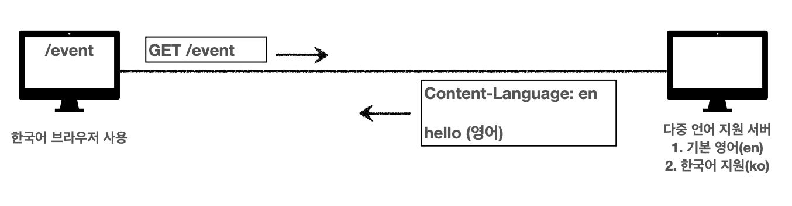

## 협상 (컨텐츠 네고네이션)
#### 클라이언트가 선호하는 표현 요청
- Accept: 클라이언트가 선호하는 미디어 타입 전달 (text/html, application/json  등등)
- Accept-Charset: 클라이언트가 선호하는 문자 인코딩
- Accept-Encoding: 클라이언트가 선호하는 압축 인코딩
- Accept-Language: 클라이언트가 선호하는 자연 언어  
`협상 헤더는 요청시에만 사용한다`


<br>


## Accept-Language 적용 전


클라이언트가 한국어인지, 영어인지 아무런 정보가 없다.  
서버는 다중 언어를 지원하고 내부 자연언어 우선순위
1. 기본 영어 (en)
2. 한국어 지원(ko)

이렇게 왔다고 쳤을 때, 한국어를 지원하지만 내부 우선 순위 첫 번째가 영어이기 때문에 영어로 응답이 온다.


<br>


## Accept-Language 적용 후


1. 이번엔 요청시에 Accect-Language를 사용해서 한국어로 요청했다  
2. 서버 내부에서 우선순위 첫 번째가 영어이지만 요청 시 Accect-Language 사용했기때문에 한국어로 응답 해준다. `(클라이언트가 한국어를 원한다.)`


<br>


## Accept-Language 복잡한 예시


1. 요칭시에 Accect-Language를 사용해서 한국어로 요청했다
2. 하지만 서버에서는 한국어를 지원하지 않는다.  
3. 서버 내부 `우선순위는 기본 독일어가 첫 번째, 영어가 두 번째이다`.  
4. 이런 경우에는 서버는 독일어로 응답해준다.

하지만 한국 사용자 입장에서 본다면 독일어 보다는 영어가 낫다.  
이런 경우에 `한국어를 지원하지 않는다면 영어로 응답을 해줘.` 등 의 복잡한 상황에서는 어떻게 사용할까?

<br>

## 우선순위 1
#### Quality Values(q)

```
GET /event
Accept-Language: ko-KR;ko;q=0.9,en-US;q=0.8,en;q=0.7
```

- Quality Values(q) 값 사용
- 0~1, `클수록 높은 우선 순위`
- 생략하면 1
- Accept-Language: ko-KR;ko;q=0.9,en-US;q=0.8,en;q=0.7
  - 1. ko-KR;q=1 (생략하면 q는 1)
  - 2. ko;q=0.9
  - 3. en-US;q=0.8
  - 4. en;1=0.7

<br>

## 우선순위 ## Accept-Language 사용 예시


1. 클라이언트가 Accept-Language 필드에 우선순위까지 명시해서 요청 했다.
2. 서버는 Accept-Language 헤더를 보고 서버가 지원하는 언어중 우선순위가 제일 높은 영어로 응답해준다.


<br>

## 우선순위 2
#### Quality Values(q)

```
GET /event
Accept: text/*, text/plain, text/plain;format=flowed, */*
```

- 구체적인 것이 우선이다.
- `Accept: text/*, text/plain, text/plain;format=flowed, */*`
  - 1. text/plain;format=flowed
  - 2. text/plain
  - 3. text/*
  - 4. */ *

즉, 클라이언트가 요청할때 구체적으로 명시해서 요청한다면 우선순위 높은것을 매칭해준다.  
예시로 클라이언트가 text/html로 요청을 하면 text/* 이게 매칭이 될것이고,   
text/plain 으로 요청하면 text/plain이 매칭 된다.  
그럼 application/json으로 요청하면 4번쨰 우선순위인 */ * 매칭된다.  
구체적으로 text/plain;format=flowed 명시하면 제일 우선순위 높은것이 매칭 된다.  


<br>

## 우선순위 3
#### Quality Values(q)

- 구체적인 것을 기준으로 미디어 타입을 맞춘다.

```
Accept: text/*;q=0.3, text/html;q=0.7, text/html;level=1, text/html;level=2;q=0.4, * /*;q=0.5
```

| Media Type      | Quality      |
|------------|------------|
| text/html;level=1    | 1 (q 생략하면 1)    |
| text/html    | 0.7    |
| text/plain    | 0.3 (`text/plain은 text/* 과 매칭`)    |
| image/jpg    | 0.5  (`* /*;q=0.5 과 매칭`)  |
| text/html    | 0.7    |
| text/html;level=2    | 0.4    |
| text/html;level=3    | 0.7 (`text/html 과 매칭` level=2, level=3은 구체적이로 level 값을 명시했기 때문에 매칭이 안된다)    |

