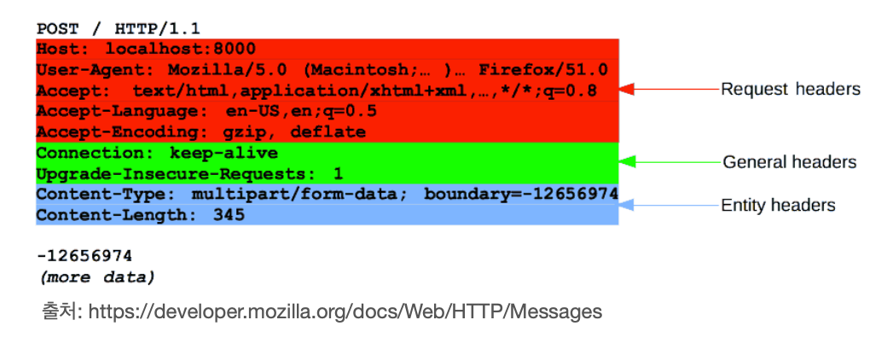

## HTTP 헤더
- header-field = field-name ":" OWS field-value OWS `(OWS: 띄워쓰기 허용)`
- field-name은 대소문자 구분 없음

#### 요청 헤더
```angular2html
Host:www.google.com
```
#### 응답 헤더
```angular2html
Context-Type: text/html;charset=UTF-8
COntext-Length: 3423
```

## HTTP 헤더 용도
- HTTP 전송에 필요한 모든 부가정보가 들어있다.
  - 예) 메시지 바디의 내용, 메시지 바디의 크기, 압축, 인증, 요청 클라이언트, 서버 정보, 캐시 관리 정보 ...
- 표준 헤더가 많다.
- 필요시 임의의 헤더 추가 가능

<br>

## HTTP 헤더 분류 - RFC2616(과거)
- 
- 헤더 분류
  - General 헤더: 메시지 전체에 적용 되는 정보 예)Connection: close, (요청, 응답 상관 없이 전체에 적용)
  - Request 헤더: 요청 정보 예) User-Agent: Mozilla/5.0 (Macintosh; ...)(웹 브라우저 정보)
  - Response 헤더: 응답 정보 예) Server: Apache (현재 요청을 받아 처리하는 서버 정보)
  - Entity 헤더: 엔티티 바디정보 예) Context-Type:application/json, Context-Length: 3200

<br>

## HTTP 바디 - mseeage body - RFC2616(과거)

#### 엔티티헤더
```
Context-Type: text/html;chatset=UTF-8
Context-Length: 3423
```

#### 엔티티본문 (메시지 본문)
```
<html>
    <body>...</body>
</html>
```
- 메시지 본문(message body)은 엔티티 본문(entity body)을 전달하는데 사용
- 엔티티 본문은 요청이나 응답에서 전달할 실제 데이터 (메시지 본문안에 엔티티 본문을 담아서 전송)
- 엔티티 헤더는 엔티티 본문의 데이터를 해석할 수 있는 정보 제공
  - 데이터 유형(html, json), 데이터 길이, 압축 정보 등등..


<br>

## HTTP 표준 변경
- 1999년 RFC2616 (X) - 폐기
- 2014년 RFC7230 ~ 7235 등장

<br>

## RFC723x 변화
- 엔티티(entity) -> 표현(Representation)
- Representation == represetation Metadata + represetation Data
- 표현 == 표현 메타데이터 + 표현 데이터


<br>

## HTTP 바디 - message body - RFC7230(최신)

#### 표현 헤더
``` 
Context-Type: text/html;charset=UTF-8
Context-Length: 3423
```

#### 메시지 본문, 표현 데이터
``` 
<html>
    <body>...</body>
</html>
```

<br>

- 메시지 본문(message body)을 통해 데이터 전달
- 메시지 본문 == 페이로드(payload)
- 표현은 요청이나 응답에서 전달할 실제 데이터 `(표현은 표현 헤더 + 표현 데이터)`
- 표현 헤더는 표현 데이터를 해석할 수 있는 정보 제공
  - 데이터 유형(html, json), 데이터 길이, 압축 정보 등등
- 참고: 표현 헤더는 표현 메타데이터와 페이로드 메시지를 구분해야 하지만, 여기서는 생략

`표현이라고 하는 이유는 예를들어 회원과 관련된 회원 조회 내역을 html로 제공해준다고 해보자` <br>
`회원 이라는 리소스를 html로 표현 했다고 말할 수 있다` <br>
`json으로 조회를 하면 회원이라는 리소스를 json 또는 html로 표현해서 전달할 수 있다`
