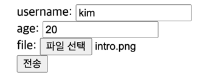

# 클라이언트에서 서버로 데이터 전송 `데이터 전달 방식은 크게 2가지`
- 쿼리 파라미터를 통한 데이터 전송
  - GET
  - 주로 정렬 필터(검색어)
- 메시지 바디를 통한 데이터 전송
  - POST, PUT, PATCH
  - 회원가입, 상품 주문, 리소스 등록, 리소스 수정 등..

<br>
  
# 클라이언트에서 서버로 데이터전송 예시 4가지
- 정적 데이터 조회
  - 이미지, 정적 텍스트 문서
- 동적 데이터 조회
  - 주로 검색, 게시판 목 정렬 필터(검색어)
- HTML FORM을 통한 데이터 전송
  - 회원가입, 상품주문, 데이터변경
- HTTP API를 통한 데이터 전송
  - 회원가입, 상품주문, 데이터변경
  - 서버 to 서버, 앱 클라이언트, 웹 클라이언트(Ajax)

<br>

## 정적 데이터 조회
**쿼리 파라미터 미사용**

```angular2html
GET /static/star.jpg HTTP/1.1
Host: localhost:8080
```


```angular2html
HTTP/1.1 200 OK
Content-Type: image/jpg
Content-Length: 34012

asdasdsadsad;;12312312asdnjsadj12891213
sajdbashdsadsa;dasdndjasd1223
```

### 정리
- 서버에서  /static/star.jpg 이미지를 반환해줌
- 이미지, 정적 텍스트 문서
- 조회는 GET 사용
- 정적 데이터는 일반적으로 쿼리 파라미터 없이 리소스 경로로 단순하게 조회 가능

<br>


## 동적 데이터 조회
**쿼리 파라미터 사용**

```angular2html
GET /search?q=hello&hi=ko HTTP/1.1
Host: localhost:8080
```

`쿼리 파라미를 기반으로 정렬 필터해서 결과를 동적으로 생성`

### 정리
- 주로 검색, 게시판 목록에서 정렬 필터(검색어)
- 조회 조건을 줄여주는 필터, 조회 결과를 정렬하는 정렬 조건에 주로 사용
- 조회는 GET 사용
- GET은 쿼리 파라미터 사용해서 데이터 전달


<br>

# HTML FORM 데이터 전송
### POST 전송-저장


- HTML
- 사용자가 username 필드에는 kim, agee 필드에는 20을 입력했다고 가정
```angular2html
<form action="/save" method="post">
  <input type="text" name="username" />
  <input type="text" name="age" />
  <button type="submit">전송</button>
</form>
```

<br>

웹 브라우저가 생성한 요청 HTTP 메시지

```angular2html
POST /save HTTP/1.1
Host: localhost:8080
Content-Type: application/x-www-form-urlencoded

username=kim&age=20
```

### GET 전송-저장

- HTML
- 사용자가 username 필드에는 kim, agee 필드에는 20을 입력했다고 가정
```angular2html
<form action="/save" method="get">
  <input type="text" name="username" />
  <input type="text" name="age" />
  <button type="submit">전송</button>
</form>
```

<br>

웹 브라우저가 생성한 요청 HTTP 메시지

```angular2html
GET /save?username=kim&age=20 HTTP/1.1
Host: localhost:8080
```

`HTML FORM으로 데이터 전송 할때 GET 메서드도 사용이 가능하지만 GET 메서드는 조회에만 사용하자 !` <br>
`리소스 변경이 발생하는 곳에 GET 메서드를 사용하면 안됨`<br>
`멤버를 조회할때 사용`

<br>

### multpart/form-data (첨부파일) 전송



```angular2html
<form action="/save" method="get" enctype="multipart/form-data">
  <input type="text" name="username" />
  <input type="text" name="age" />
  <button type="submit">전송</button>
</form>
```

웹 브라우저가 생성한 HTTP 메시지

```angular2html
POST /save HTTP/1.1
Host: localhost:8080
Content-Type: multipart/form-data; boundary=-----XXX
Content-Length: 10457
------XXX
Content-Disposition: form-data; name="username"
kim
------XXX
Content-Disposition: form-data; name="age"
20
------XXX
Content-Disposition: form-data; name="file1"; filename="intro.png"
Content-Type: image/png
109238a9o0p
```

웹 브라우저가 경계를 나누어서
username, age 필드에 값을 넣어준다
multpart (여러 타입이 들어가는 것)

### 정리
- HTML Form submit시 POST 전송
  - 예) 회원 가입, 상품 주문, 데이터 변경


- Content-Type: application/x-www-form-urlencoded 사용
  - form의 내용을 메시지 바디를 통해서 전송(key=value, 쿼리 파라미터 형식)
  - 전송 데이터를 url encoding 처리
    - 예) abc김 -> abc%EA%B9%80


- HTML Form은 GET 전송도 가능


- Content-Type: multipart/form-data
  - 파일 업로드 같은 바이너리 데이터 전송시 사용
  - 다른 종류의 여러 파일과 폼의 내용 함께 전송 가능(그래서 이름이 multipart)
- 참고: HTML Form 전송은 GET, POST만 지원

<br>

# HTTP API 데이터 전송

```angular2html
POST /members HTTP/1.1
Content-Type: application/json

{
    "username": "young"
    "age": 20
}
```

#### 정리
- 서버 to 서버
  - 백엔드 시스템 통신
- 앱 클라이언트
  - 안드로이드, IOS
- 웹 클라이언트
  - HTML 에서 Form전송 대신 자바 스크립트를 통한 통신에 사용(AJAX)
  - 예) React, VueJs 같은 웹 클라이언트 API 통신
- POST, PUT, PATCH: 메시지 바디를 통한 데이터 전송
- GET: 조회, 쿼리 파라미터로 데이터 전달
- Content-Type: application/json을 주로 사용 (사실상 표준)
  - TEXT, XML, JSON 등등


