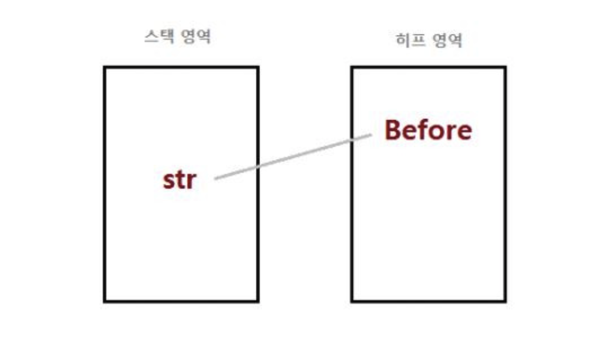

# Garbage Collection(GC) 란?
> 가비지 컬렉션(Garbage Collection, 이하 GC)은 자바의 메모리 관리 방법 중의 하나로  
> JVM(자바 가상 머신)의 Heap 영역에서 동적으로 할당했던 메모리 중 필요 없게 된  
> 메모리 객체(garbage)를 모아 주기적으로 제거하는 프로세스를 말한다.

참고: C / C++ 언어에서는 이러한 가비지 컬렉션이 없어 프로그래머가 수동으로 메모리 할당과 해제를 일일이 해줘야 했었다.

> 반면 Java에서는 가비지 컬렉터가 메모리를 관리해 주기 때문에  
> Java 프로레스가 한정된 메모리를 효율적으로 사용할 수 있게 하고,  
> 개발자 입장에서는 메모리 관리, 메모리 누수 문제에 대해 관리하지 않고 개발에만 집중할 수 있다는 장점이 있다.

**예시로 좀 억지스러운 반복문을 예로 들어보자.**
```java
(int i=0; i < 9999; i++) {
    NewObject obj = new NewObject();
    obj.doSomething();
}
```

루프문에 의해서 9999건의 NewObject 객체는 for문 스코프 내에서 생성되고 사용되지만,  
루프가 끝나고 루프 밖에서는 더이상 사용할 일이 없어진다.  
만일 이런 객체들이 메모리를 계속 점유하고 있다면, 메모리 자원은 지속적으로 줄어들기만 할 것 이다.  
하지만 우리는 별다른 작업을 하지않고 다음 구현 코드를 이어갈 것이다.  
이것이 가능한 이유가 `가비지 컬렉션`이 한번 쓰이고 버려지는 객체들을 주기적으로 정리해줌 으로써  
한정된 메모리를 효율적으로 사용할 수 있게 해주기 때문이다.

`가비지 컬렉터: 쓰레기를 수집해준다`  
`여기서 말하는 쓰레기는 Heap 메모리에 생성된 객체들 중에 더이상 참조 되지 않는 객체`


<br>

## 가비지 컬렉션 단점
- 자동으로 처리해주지만 메모리가 언제 해제 되는지 정확하게 알 수없어 제어하기 힘들다.
- 가비지 컬렉션(GC)가 동작하는 동안에는 다른 모든 동작을 멈추기 때문에 오버헤드가 발생  
`이를 Stop-The-World` 라고 부른다.

<br>

#### STW
- GC를 수행하기 위해 모든 JVM이 프로그램 실행을 멈추는 것을 의미.
- GC가 동작하는 동안 관련 Thread를 제외한 모든 Thread는 멈추게 되어 서비스에 이용에 차질이 생길 수 있다.
- 이 시간을 최소화 하는것이 쟁점 이다.  

이로 인해 GC가 너무 자주 발생하면 소프트웨어 성능 하락의 문제가 되기도 한다.  
따라서 어플리케이션의 성능을 유지하면서 효율적이게 GC를 실행하는 최적화 작업이 개발자의 숙제라고 한다.


<br>

## 가비지 컬렉션 대상
 가비지 컬렉션은 특정 객체가 garbage인지 아닌지 구분하기 위해서 도달성, 도달능력(Reachability) 이라는 개념을 적용한다.  
 객체에 참조가 있다면(참조 변수가 있다면) Reachable로 구분되고, 없다면 UnReachable로 구분하고 수거해버린다.
- Reachable : 객체가 참조되고 있는 상태
- Unreachable  : 객체가 참조되고 있지 않은 상태 (GC의 대상이 됨) 

예를들어 이런 코드가 있다고 가정해보자.
```java
1. String str = new String("Before");
2. str = new String("After");
```

JVM의 메모리 에서는 객체들을 실질적으로 Heap영역에서 생성되고 Method Area이나 Stack Area에서는 Heap Area에 생성된 객체의 주소만 참조하는 형식으로 구성된다.

- Stack 영역: 지역변수, 파라미터 값 등 임시 값
- Method 영역: 메소드
- Heap 영역: 객체(new로 생성)

<br>

따라서 1번 라인을 실행하면,  
<br>

다음과 같이 할당 될 것이다.

<br>

2번 라인을 수행한다면? str이라는 변수는 스택 영역에 새롭게 할당되지 않고,  
힙 영역에 After이라는 새로운 객체가 생성되며 str변수가 이 객체를 참조한다.

<br>


<br>
 JDK7까지는 Permanent 영역이 존재하였지만 JDK8부터는 Permanent 영역이 사라지고 일부가 Metaspace 영역으로 변경되었다.

`여기서 Before 객체가 Unreachable Object가 되는 것이다.`  
이 경우를 제외하고도 객체들이 메소드가 끝나거나 하는 이벤트들로 인하여  
힙 영역의 객체를 참조하는 참조 변수들이 삭제되는 현상이 발생하면 참조하지 않은 객체(Unreachable Object)들이 발생하게 된다.  
`이러한 객체들을 가비지 컬렉터가 제거 해주는 것이다`


<br>

## 가비지 컬렉션 청소 방식
GC가 Unreachable Object 들을 어떠한 방식으로 청소할까?  
가비지 컬렉터는 Mark-Sweep의 과정을 통해 실행된다.  
`Mark-Sweep 이란 다양한 GC에서 사용되는 객체를 솎아내는 내부 알고리즘`  
가비지 컬렉션이 동작하는 기초적인 청소 과정이라고 생각하면 된다.

> 가비지 컬렉션이 될 대상 객체를 식별(Mark)하고 제거(Sweep)하며 객체가 제거되어  
> 파편화된 메모리 영역을 앞에서부터 채워나가는 작업(Compaction)을 수행하게 된다.


- Mark 과정 : 먼저 Root Space로부터 그래프 순회를 통해 연결된 객체들을 찾아내어 각각 어떤 객체를 참조하고 있는지 찾아서 마킹한다
- Sweep 과정 : 참조하고 있지 않은 객체 즉 Unreachable 객체들을 Heap에서 제거한다.
- Compact 과정 : Sweep 후에 분산된 객체들을 Heap의 시작 주소로 모아 메모리가 할당된 부분과 그렇지 않은 부분으로 압축한다. (가비지 컬렉터 종류에 따라 하지 않는 경우도 있음)

<br>

> [GC의 Root Space]Mark And Sweep 방식은 루트로 부터 해당 객체에 접근이 가능한지가 해제의 기준이 된다.  
> JVM GC에서의 Root Space는 Heap 메모리 영역을 참조하는 method area, static 변수, stack, native method stack이 되게 된다.

`힙 영역이 가비지 컬렉터의 주요 대상`

<br>

#### JVM의 힙(heap) 영역은 동적으로 레퍼런스 데이터가 저장되는 공간으로서, 가비지 컬렉션에 대상이 되는 공간이다.

>힙 영역은 총 5개의 영역으로 나뉜다.  
>힙 영역을 여러 개로 나눈 이유는 효율적으로 GC가 일어나게 하기 위함이다. 
>JDK7까지는 Permanent 영역이 존재하였지만 JDK8부터는 Permanent 영역이 사라지고 일부가 Metaspace 영역으로 변경되었다.


<br>

## Heap 영역 설계 구조
- 대부분의 객체는 금방 접근 불가능한 상태(Unreachable)가 된다.
- 오래된 객체에서 새로운 객체로의 참조는 아주 적게 존재한다.

`즉, 객체는 대부분 일회성이며, 메모리에 오랫동안 남아있는 경우는 드물다는 것`  
이러한 특성을 이용해 JVM 개발자들은 보다 효율적인 메모리 관리를 위해, 객체의 생존 기간에 따라 물리적인 Heap 영역을 나누게 되었고 Young 과 Old 총 2가지 영역으로 설계하였다

`GC는 Minor GC, Major GC로 나뉜다.`

#### Young 영역(Young Generation)
- 새롭게 생성된 객체가 할당(Allocation)되는 영역
- 대부분의 객체가 금방 Unreachable 상태가 되기 때문에, 많은 객체가 Young 영역에 생성되었다가 사라진다
- Young 영역에 대한 가비지 컬렉션을 Minor GC 또는 Full GC 라고 부른다

<br>

#### Old 영역(Old Generation)
- Young 영역에서  Reachable 상태를 유지하여 살아남은 객체가 복사되는 영역
- Young 영역보다 크게 할당되며, 영역의 크기가 큰 만큼 가비지는 적게 발생한다.
  - 더 크게 할당되는 이유는, Young 영역이 수명이 짧은 객체들은 큰 공간을 필요하지 않고
  - 큰 객체들은 Young 영역이 아니라 Old 영역에 할당되기 때문이다.
- Old에 대한 가비지 컬렉션을 Major GC 또는 Full GC라고 부른다

<br>

## Young 3가지 영역

#### Eden
- new 연산자를 통해 생성된 객체가 위치.
- 정기적인 쓰레기 수집 후 살아남은 객체들은 survivor 영역으로 보낸다.

#### survivor1, survivor2
- 최소 1번의 GC 에서 살아남은 객체가 존재하는 영역.
- survivor 영역에는 특별한 규칙이 있는데, Survivor 0 또는 Survivor 1 둘 중 하나에는 꼭 비어 있어야 하는 것이다.

`이렇게 하나의 힙 영역을 세부적으로 쪼갬으로서 객체의 생존 기간을 면밀하게 제어하여 가비지 컬렉터를 보다 정확하게 불필요한 객체를 제거하는 프로세스를 실행하도록 한다.`


<br>

## Minor GC 과정
Young Generation 영역은 짧게 살아남는 메로리들이 저장되는 공간이다.  
모든 객체는 처음에 Young Generation 영역에 생성된다.  
Young Generation의 공간은 Old Generation에 비해 상대적으로 작기 때문에 메모리 상의 객체를 찾아 제거하는데 적은 시간이 걸린다. (작은 공간에서 데이터를 찾으니까)

1. 우리가 new 연산자를 써서 생성된 객체는 Young Generation 영역 Eden 영역에 할당
2. 객체가 계속 생성되어 Eden 영역이 꽉차게 되고, Minor GC가 실행
3. Mark 동작을 통해 reachable 객체를 탐색
4. Eden 영역에서 살아남는 객체는 survivor1 영역으로 이동.
5. Eden 영역에서 사용되지 않는 객체의 메모리를 해제(Sweep)
6. 살아남는 객체들은 age 값이 1씩 증가
7. 또 다시 Eden 영역에 신규 객체들로 가득 차게 되면 다시 한번 minor GC 발생하고 Mark 한다
8. mark 과정을 거쳐 살아남은 객체들을 비어있는 survivor2 영역으로 이동. `(survivor1, survivor2의 특징에서 둘 중 하나에는 꼭 비어 있어야 하는 규칙이 적용)`
9. 다시 살아남은 객체들은 age 값이 1증가
10. 이러한 과정을 반복한다


## Major GC 과정
- Old Generation 영역은 살아남는 객체들이 존재하는 공간이다.  
- Old Generation의 객체들은 거슬러 올라가면 Young 영역에 의해 시작 되었지만, GC 과정중에 제거 되지 않은 경우 age 임계값이 차게되어 이동된 객체들이다.
- 그리고 Major GC는 객체들이 계속 Promotion되어 Old 영역의 메모리가 부족해지면 발생한다.

`Promotion 이란? 약 Minor GC가 계속해서 발생하게 되어 survivor 영역에 있는 Reachable Object들의 age가 일정 기준을 넘게 되면 앞으로 계속해서 사용될 수 있는 객체라고 판단하여 Old generation 영역으로 옮겨준다. 이 과정을 Promotion 이라고 한다`

1. 객체의 age가 임계값(예시로 8)에 도달하게 된다
2. 이 객체들은 Old Generation 으로 이동한다. (Promotion 과정)
3. 위의 과정이 반복되어 Old Generation 영역의 공간이 부족해지면 Major GC가 발생된다.


<br>


> Major GC는 Old 영역의 공간이 가득차면 GC를 실행하는 단순한 방식이다.  
> Old 영역에 할당된 메모리가 허용치를 넘게 되면, Old 영역에 있는 모든 객체들을 검사하여 참조되지 않는 객체들을 한꺼번에 삭제하는 Major GC가 실행되게 된다  
> 하지만 Old Generation은 Young Generation에 비해 상대적으로 큰 공간을 가지고 있어, 이 공간에서 메모리 상의 객체 제거에 많은 시간이 걸리게 된다.  

`Major GC는 GC를 제외한 모든 Thread가 중지된다.`

> Old generation 영역에 있는 Unreachable Objcet를 Mark, Sweep 과정을 통해 제거한다.  
> 제거하게 되면 Heap 메모리 영역에 빈 메모리 공간이 생기게 되는데 이 부분을 없애기 위해 재구성을 하게 된다.  
>  메모리를 옮기는 도중에 다른 스레드가 메모리를 사용해버리면 안 되기 때문에 모든 스레드를 중지하는 것이다.
